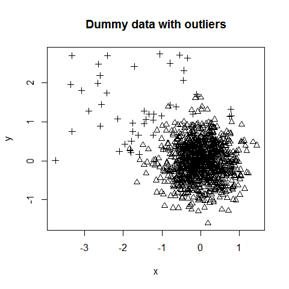
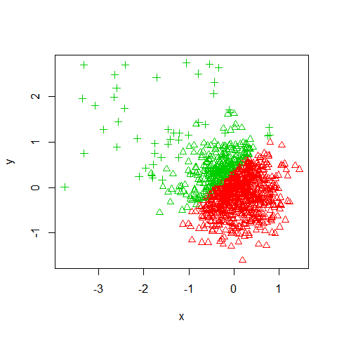

Isolation Forest
----------------

An Isolation Forest is an ensemble of completely random decision trees.
At each split a random feature and a random split point is chosen.
Anomalies are isolated if they end up in a partition far away from the
rest of the data. In decision tree terms, this corresponds to a record
that has a short "path length". The path length is the number of nodes
that a record passes through before terminating in a leaf node. Records
with short average path lengths through the entire ensemble are
considered anomalies.

An analogy
----------

Describing the location of a country home takes many fewer directions
than describing the location of a brownstone in Brooklyn. The country
home might be described as "the only house on the south shore of Lake
Woebegon". While directions to the brownstone must be qualified with
much more detail: "Go north on 5th Street for 12 blocks, take a left on
Van Buren, etc.."

 

The country house in this example is a literal outlier. It is off by
itself away from most other homes. Similarly, records that can be
described succinctly are also outliers.

Example
-------

Here we create two random, normal vectors and add some outliers.

    N = 1e3
    x = c(rnorm(N, 0, 0.5), rnorm(N*0.05, -1.5, 1))
    y = c(rnorm(N, 0, 0.5), rnorm(N*0.05,  1.5, 1))
    data = data.frame(x, y)
    plot(data)
    title("Dummy data with outliers")

    mod = iForest(X = data, 100, 32)
    p = predict(mod, data)
    col = ifelse(p > quantile(p, 0.95), "red", "blue")
    plot(x, y, col=col)

    km = kmeans(data, 2)
    plot(x, y, col=km$cluster+1)

Including Plots
---------------

You can also embed plots, for example:

Note that the `echo = FALSE` parameter was added to the code chunk to
prevent printing of the R code that generated the plot.
